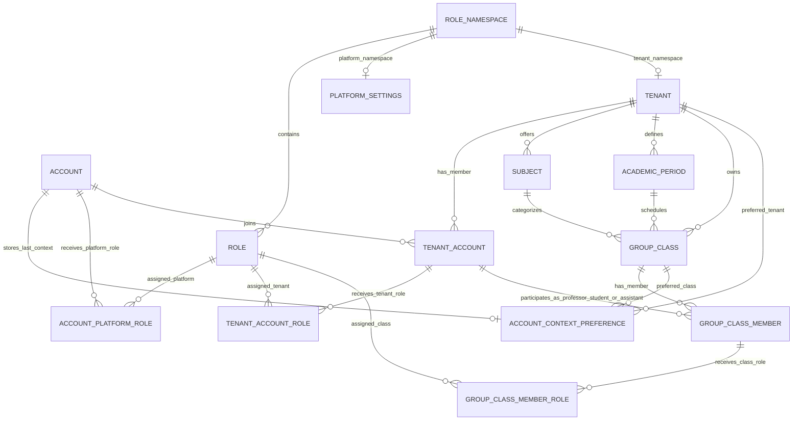
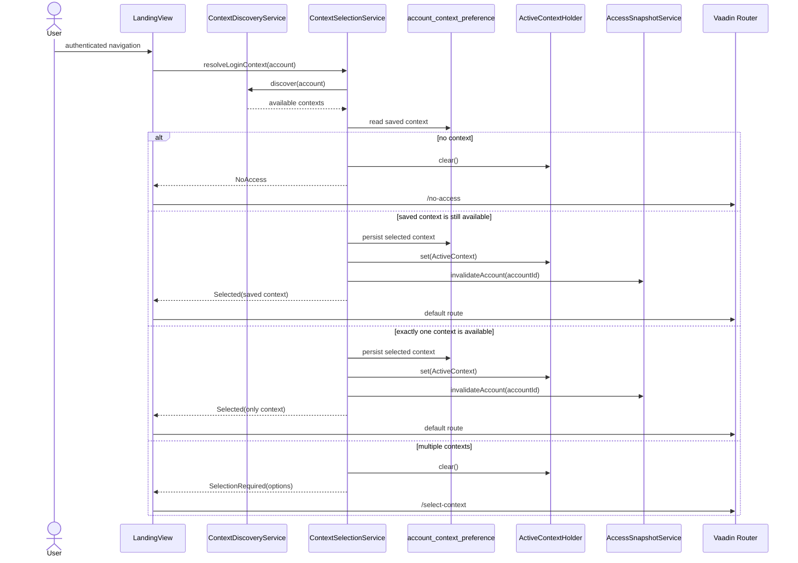
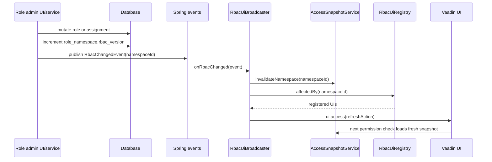

# RBAC Architecture

This application uses Spring Security for **authentication only** and a custom, context-aware RBAC layer for application authorization.

The important split is:

```text
Spring Security Authentication = who is logged in
ActiveContext                  = where they are acting
UserAccessSnapshot             = what they can do there
Domain services                = which records they can see or mutate
```

Do not add contextual permissions to Spring authorities. A logged-in account may have different permissions in platform, tenant, and group-class contexts, so permissions are resolved after context selection.

## Core idea

Roles grant permissions. Membership defines academic identity. Ownership filters data.

```text
Role permissions  -> feature capability
Group membership  -> professor/student/assistant identity
Ownership columns -> which conversations, activities, documents, etc. are visible
```

A tenant admin may manage classes through tenant authority without being a professor or student in any class. Conversely, a professor or student receives classroom identity from `group_class_member.member_kind`, not from RBAC role names.

The same account may have several valid work contexts at the same time. For example, one person can be a tenant admin through `tenant_account_role`, a professor through one `group_class_member` row, and a student through another `group_class_member` row. The selected `ActiveContext` decides which tenant or class they are currently operating in.

```mermaid
flowchart LR
    subgraph Identity[Identity]
        Auth[Spring Security authentication\nlogged-in account]
        Membership[group_class_member.member_kind\nPROFESSOR / STUDENT / ASSISTANT]
    end

    subgraph Context[Selected work context]
        Active[ActiveContext\nPLATFORM | TENANT | GROUP_CLASS]
        Preference[account_context_preference\nlast selected context]
    end

    subgraph Authorization[Authorization result]
        Snapshot[UserAccessSnapshot\neffective role codes + permission codes]
    end

    subgraph Enforcement[Runtime enforcement]
        Routes[Vaadin routes and navigation\n@RequiresPermission]
        Services[Domain services\ntenant/class/ownership rules]
        Records[Allowed records and mutations]
    end

    Auth --> Active
    Preference -. restored at login .-> Active
    Active --> Snapshot
    Membership --> Services
    Snapshot --> Routes
    Snapshot --> Services
    Services --> Records
```

## Data model

RBAC is stored with code-owned permission strings. There are no database tables for resources, actions, permissions, or role-permission joins.

### Permission catalog

Permissions live in Java:

- `com.wornux.security.permission.AppResource`
- `com.wornux.security.permission.AppAction`
- `com.wornux.security.permission.AppPermission`

Each `AppPermission` has a stable persisted code, for example:

```text
role:view
role:assign
conversation:create
training-activity-assignment:update
```

The database stores permissions directly in `role.permissions text[]`.

### Entity relationship overview



### Role namespaces

Roles belong to a namespace:

```text
role_namespace
- id
- code
- rbac_version
```

There is one platform namespace and one namespace per tenant.

The namespace version is part of the snapshot cache key. When roles or assignments change, the namespace version increments, so old snapshots stop matching new cache keys.

### Roles

A role is a permission bundle:

```text
role
- role_namespace_id
- code
- name
- assignment_level: PLATFORM | TENANT | GROUP_CLASS
- permissions text[]
- priority
- system_defined
- assignable
- active
```

`assignment_level` decides where the role can be assigned:

| Assignment level | Assignment table |
| --- | --- |
| `PLATFORM` | `account_platform_role` |
| `TENANT` | `tenant_account_role` |
| `GROUP_CLASS` | `group_class_member_role` |

Do not infer assignment tables from role names. The source of truth is `role.assignment_level`.

### Role priority

Role priority is a role-management boundary, not a feature permission.

Higher numbers represent stronger administrative authority. An actor's effective management priority is the highest priority among their active roles in the current role namespace. The actor may create, update, assign, or remove only roles whose priority is strictly lower than that value.

Equal priority is intentionally blocked. This prevents an administrator from creating a peer role, editing a peer role, or using assignment to grant someone else the same administrative level.

Examples:

| Actor highest priority | Allowed target priorities | Blocked target priorities |
| ---: | --- | --- |
| 100 | 0-99 | 100 and above |
| 80 | 0-79 | 80 and above |
| 60 | 0-59 | 60 and above |
| 40 | 0-39 | 40 and above |

Priority does not imply permissions. A role with priority `80` can perform `role:update` only if its permission list includes `role:update`. RBAC mutations therefore require both conditions: the actor must have the required permission, and the target role must be below the actor's priority boundary.

### Role templates and seeded roles

Built-in roles are defined as code-owned templates in `RoleTemplate`:

| Template | Assignment level | Priority | Assignable | Purpose |
| --- | --- | ---: | --- | --- |
| `SYSTEM_ADMIN` | `PLATFORM` | 100 | no | Bootstrap platform administration |
| `TENANT_ADMIN` | `TENANT` | 80 | yes | Institution-level academic administration |
| `PROFESSOR` | `GROUP_CLASS` | 60 | yes | Professor capabilities inside a class |
| `STUDENT` | `GROUP_CLASS` | 40 | yes | Student capabilities inside a class |

Templates are not assigned directly. `RoleTemplateSeeder.ensureRole(namespace, template)` first looks for a role with the template code in the target namespace. If it exists, that existing database role is reused. If it does not exist, a new role row is created from the template fields.

This makes templates a safe bootstrap mechanism:

- production migrations create the platform namespace, `SYSTEM_ADMIN`, and the first system admin assignment;
- tenant creation creates a tenant-specific role namespace and seeds `TENANT_ADMIN`, `PROFESSOR`, and `STUDENT` into that namespace;
- invitation acceptance calls `ensureRole` again before assignment, so missing default roles can be recreated safely;
- existing roles are not silently rewritten by `ensureRole`; template changes that must affect existing databases require migrations or explicit sync logic.

Template selection is deterministic and comes from business flow, not from priority:

| Flow | Template selected | Assignment created |
| --- | --- | --- |
| System admin bootstrap | `SYSTEM_ADMIN` | `account_platform_role` |
| Tenant admin invitation accepted | `TENANT_ADMIN` | `tenant_account_role` |
| Professor invitation accepted | `PROFESSOR` | `group_class_member_role` |
| Student invitation accepted | `STUDENT` | `group_class_member_role` |

For professor and student invitations, RBAC assignment is paired with classroom membership creation or reuse. The `RoleTemplate` grants permissions; `group_class_member.member_kind` records academic identity.

### Classroom identity

`group_class_member.member_kind` stores classroom identity:

```text
PROFESSOR | STUDENT | ASSISTANT
```

RBAC role assignment does not change `member_kind`. Assigning a `GROUP_CLASS` role can change permissions, but it must not convert a student into a professor or vice versa.

An account participates in a tenant through `tenant_account`. Tenant authority is assigned to that tenant account through `tenant_account_role`. Classroom identity is assigned separately through `group_class_member`, which links that same tenant account to a group class as `PROFESSOR`, `STUDENT`, or `ASSISTANT`. This lets one account operate as a tenant administrator for the institution while also having professor or student identities in concrete classes.

## Login and context lifecycle

Login does not route by role name. It resolves available contexts first.

Main classes:

- `ContextDiscoveryService`
- `ContextSelectionService`
- `ActiveContextHolder`
- `AvailableContextOption`

### Context discovery

`ContextDiscoveryService.discover(account)` returns context options:

| Context | How it is discovered |
| --- | --- |
| `PLATFORM` | account has an active platform role assignment with platform administration permissions |
| `TENANT` | account has an unlocked tenant account with an active tenant role that grants tenant administration reach |
| `GROUP_CLASS` | account has an unlocked `group_class_member` row |

Tenant-admin reach does not create class context options. Class options come only from real class membership rows.

### Context selection

`ContextSelectionService.resolveLoginContext(account)` follows this lifecycle:

1. Discover available contexts.
2. If none exist, clear the active context and return `NoAccess`.
3. If a saved `account_context_preference` is still available, restore it.
4. If exactly one context exists, select it automatically.
5. If multiple contexts exist, send the user to context selection.
6. Persist the chosen context.
7. Store `ActiveContext` in `VaadinSession` through `ActiveContextHolder`.
8. Invalidate the account's old snapshots.
9. Navigate to the default route for the selected context.

Default routes:

| Context | Default route |
| --- | --- |
| `PLATFORM` | `/admin` |
| `TENANT` | `/tenant` |
| `GROUP_CLASS` | `/chat` |



`ActiveContextHolder` stores context in the Vaadin session in normal UI requests. It also has a thread-local fallback for service/integration tests where no Vaadin session exists.

## Runtime authorization

Main classes:

- `AuthorizationService`
- `AccessSnapshotService`
- `UserAccessSnapshot`
- `@RequiresPermission`
- `PermissionMethodAspect`
- `PermissionNavigationAccessChecker`

### UserAccessSnapshot

`AuthorizationService.snapshot()` requires:

1. an authenticated principal, and
2. an active context.

It returns a `UserAccessSnapshot` containing:

```text
accountId
tenantId
tenantAccountId
groupClassId
groupClassMemberId
memberKind
roleCodes
permissionCodes
roleNamespaceVersion
```

Snapshot loading depends on context:

| Active context | Loaded assignments |
| --- | --- |
| `PLATFORM` | `account_platform_role` only |
| `TENANT` | `tenant_account_role` only |
| `GROUP_CLASS` | tenant roles plus group-class roles if real class membership exists |

For group-class context, tenant-admin class reach is represented by tenant permissions. If the actor has no real class membership, `groupClassMemberId` is `null` and `memberKind` is `null`.

Effective permissions are intentionally context-sensitive. Switching from `TENANT` to `GROUP_CLASS` keeps the account inside the same tenant namespace, then adds class-member roles for the active class membership when present. Domain services use `tenantId`, `tenantAccountId`, `groupClassId`, `groupClassMemberId`, and `memberKind` from the snapshot to apply record-level rules.

### Snapshot construction

```mermaid
flowchart TD
    Start[AuthorizationService.snapshot(account, ActiveContext)] --> Level{ActiveContext level}

    Level -->|PLATFORM| PlatformNamespace[Resolve platform role namespace]
    PlatformNamespace --> PlatformRoles[Load account_platform_role]
    PlatformRoles --> PlatformSnapshot[UserAccessSnapshot\nroleCodes + permissionCodes\ntenantId=null\ngroupClassId=null]

    Level -->|TENANT| TenantNamespace[Resolve tenant role namespace]
    TenantNamespace --> TenantAccount[Resolve tenant_account]
    TenantAccount --> TenantRoles[Load tenant_account_role]
    TenantRoles --> TenantSnapshot[UserAccessSnapshot\ntenantId + tenantAccountId\ngroupClassId=null]

    Level -->|GROUP_CLASS| ClassNamespace[Resolve tenant role namespace]
    ClassNamespace --> ClassTenantAccount[Resolve tenant_account]
    ClassTenantAccount --> ClassTenantRoles[Load tenant_account_role]
    ClassTenantRoles --> Member{Unlocked group_class_member?}
    Member -->|yes| ClassRoles[Load group_class_member_role]
    ClassRoles --> ClassSnapshot[UserAccessSnapshot\ntenant roles + class roles\ngroupClassMemberId + memberKind]
    Member -->|no| TenantReachSnapshot[UserAccessSnapshot\ntenant roles only\ngroupClassMemberId=null]

    PlatformSnapshot --> CacheKey[Cache key includes\naccount + context + namespace + rbac_version]
    TenantSnapshot --> CacheKey
    ClassSnapshot --> CacheKey
    TenantReachSnapshot --> CacheKey
```

### Snapshot caching

`AccessSnapshotService` uses Caffeine with a bounded local cache.

Cache key:

```text
accountId + contextLevel + tenantId + groupClassId + roleNamespaceId + roleNamespaceVersion
```

This is local-memory only. It is intentionally not Redis, PostgreSQL LISTEN/NOTIFY, or clustered invalidation.

Invalidation APIs:

- `invalidateNamespace(roleNamespaceId)`
- `invalidateAccount(accountId)`
- `invalidateContext(accountId, activeContext)`

### Permission checks

Use `AuthorizationService` for dynamic checks:

```java
authorizationService.can(AppPermission.ROLE_VIEW)
authorizationService.check(AppPermission.ROLE_ASSIGN)
```

Prefer annotations for static checks:

```java
@RequiresPermission(AppPermission.ROLE_ASSIGN)
public void setTenantRole(...) { ... }
```

`PermissionMethodAspect` intercepts `@RequiresPermission` on service methods and classes and delegates to `AuthorizationService.check(...)`.

## Vaadin route authorization

Route authorization is also custom and permission-driven.

`PermissionNavigationAccessChecker` rules:

1. `@AnonymousAllowed` routes are allowed.
2. Unauthenticated users are denied.
3. Routes with `@RequiresPermission` are checked through `AuthorizationService`.
4. Auth routes under `com.wornux.ui.auth` with `@PermitAll` are allowed.
5. Protected app routes without `@RequiresPermission` are denied by default.

This means adding a new protected Vaadin view requires both:

```java
@Route(...)
@RequiresPermission(AppPermission.SOME_PERMISSION)
```

```mermaid
flowchart TD
    Nav[Vaadin navigation request] --> Public{Public route?\n@AnonymousAllowed or permitted auth view}
    Public -->|yes| Allow[Allow navigation]
    Public -->|no| Auth{Authenticated account?}
    Auth -->|no| DenyAuth[Deny\nauthentication required]
    Auth -->|yes| Annotation{Route declares\n@RequiresPermission?}
    Annotation -->|no| DenyStrict[Deny\nprotected routes must declare a permission]
    Annotation -->|yes| Context[Ensure ActiveContext\nrestore login context if needed]
    Context --> Workspace[Prepare required workspace\nSYSTEM_ADMIN / TENANT_ADMIN / PROFESSOR / STUDENT]
    Workspace --> Check[AuthorizationService.can(permission)]
    Check -->|true| Allow
    Check -->|false| DenyPerm[Deny\nmissing permission]
```

Navigation menu visibility is not security. It only controls what links are shown.

## Main navigation

The sidebar menu comes from:

- `NavigationRegistry`
- `WorkspaceDrawerNavigation`
- `MainLayout`

`NavigationRegistry` defines entries with:

```text
label
route target
minimum context level
required permission
order
```

`MainLayout` filters entries by active context and by `AuthorizationService.can(...)`.

`WorkspaceDrawerNavigation` renders the links and maps labels to icons. If you add a navigation entry and want a specific icon, update `iconFor(...)` there.

Current examples:

| Entry | Permission |
| --- | --- |
| Administración | `tenant:view` |
| Institución | `group-class:create` |
| Panel profesoral | `group-class-member:view` |
| Panel estudiantil | `training-activity-assignment:view` |
| Matriz de roles | `role:view` |
| Roles de tenant | `role:assign` |
| Roles de clase | `role:assign` |
| Conversación | `conversation:view` |
| Documentos | `course-material:view` |
| Actividades | `training-activity:view` |

### Alfredo example

In dev data, Alfredo is a professor in the algorithms class. His `PROFESSOR` group-class role includes:

- `group-class-member:view`
- `conversation:view`
- `course-material:view`
- `training-activity:view`
- other professor class-management permissions

Therefore Alfredo can access `Panel profesoral` when his active context is his `GROUP_CLASS` context. The concrete permission needed for that panel is:

```text
group-class-member:view
```

## Role matrix and assignments

Main classes/views:

- `RoleAdministrationService`
- `RoleMatrixView`
- `TenantMemberRoleAssignmentView`
- `GroupClassMemberRoleAssignmentView`

### Role matrix

`RoleMatrixView` is protected by:

```java
@RequiresPermission(AppPermission.ROLE_VIEW)
```

Context behavior:

| Context | Behavior |
| --- | --- |
| Platform | show platform roles only |
| Tenant | show tenant roles or group-class roles via selector |
| Group class | do not create roles; show explanation to manage roles from tenant context |

### Role creation

Role creation requires:

```java
@RequiresPermission(AppPermission.ROLE_CREATE)
```

Validation includes:

- name is required,
- role code is generated from name and unique in the namespace,
- permission strings must be known `AppPermission` codes,
- permissions must be valid for the assignment level,
- actor must already have every permission they grant,
- new role priority must be lower than the actor's highest role priority in that namespace.

### Role update

Role update requires:

```java
@RequiresPermission(AppPermission.ROLE_UPDATE)
```

Important rules:

- assignment level cannot be changed after creation,
- actor cannot manage roles at or above actor priority,
- requested priority must also remain below the actor's highest role priority in that namespace,
- actor cannot add permissions outside their snapshot,
- tenant context cannot edit system-defined roles.

### Role assignment

Role assignment requires:

```java
@RequiresPermission(AppPermission.ROLE_ASSIGN)
```

Tenant assignments use active tenant members and active assignable roles where:

```text
role.assignment_level = TENANT
```

Group-class assignments use selected class members and active assignable roles where:

```text
role.assignment_level = GROUP_CLASS
```

RBAC assignment never edits `group_class_member.member_kind`.

## RBAC changes and UI refresh

Any role or role-assignment mutation must:

1. write the data,
2. increment `role_namespace.rbac_version`,
3. publish `RbacChangedEvent`,
4. invalidate local snapshots for that namespace,
5. refresh registered UIs via `UI.access(...)`.

Current flow:

```text
RoleAdministrationService / RoleNamespaceService
  -> increment rbac_version
  -> publish RbacChangedEvent
  -> RbacUiBroadcaster
  -> AccessSnapshotService.invalidateNamespace(...)
  -> RbacUiRegistry affected UIs
  -> ui.access(refreshAction)
```

The broadcaster does not mutate UI from the Spring event thread directly. It schedules changes through `UI.access(...)`.



## Seed and lifecycle scenarios

### Scenario: app starts with production migrations only, no dev dummy data

This is the expected clean-start production shape.

`V1__baseline.sql` creates:

- the platform role namespace,
- `platform_settings`,
- the `SYSTEM_ADMIN` platform role,
- the initial `admin@wornux.com` account,
- an `account_platform_role` assignment for that admin,
- an account context preference for platform context.

What happens:

1. `admin@wornux.com` can log in.
2. Context discovery finds one `PLATFORM` context.
3. The context is selected automatically.
4. The user lands on `/admin`.
5. No tenants or classes exist yet.
6. The system admin can create tenants.
7. Tenant creation creates a tenant role namespace and seeds tenant default roles.

Alfredo, Camacho, and Cristian are dev dummy accounts. Without dev data, those accounts do not exist.

### Scenario: app starts with dev dummy data enabled

`V2__dev_dummy_data.sql` adds:

- Wornux Academy tenant,
- tenant namespace,
- Tenant Admin, Professor, and Student roles,
- Camacho tenant-admin account,
- Alfredo professor account,
- Cristian student account,
- sample classes and memberships,
- role assignments.

Typical outcomes:

| Account | Context | Main abilities |
| --- | --- | --- |
| `admin@wornux.com` | Platform | create tenants, manage platform roles |
| `camacho@wornux.com` | Tenant | manage tenant classes, roles, tenant/class assignments |
| `alfredo@wornux.com` | Group class | professor workspace, conversations, documents, activities |
| `cristiandelahooz@wornux.com` | Group class | student workspace, conversations, assigned activities |

### Scenario: account exists but has no roles and no class membership

Context discovery returns no options.

Outcome:

- active context is cleared,
- login resolves to `NoAccess`,
- protected routes remain denied because `AuthorizationService.snapshot()` requires an active context.

### Scenario: account has a tenant role but no class membership

The account gets a `TENANT` context.

If the tenant role grants class-management permissions, the account can manage classes from tenant context. It does not get class switcher options unless it has real `group_class_member` rows.

### Scenario: tenant admin opens a group-class context without class membership

Normally, the UI should not offer that context. If a service call manually sets a group-class context, snapshot loading still unions tenant roles and any class roles from real membership. If there is no membership, `groupClassMemberId` and `memberKind` are `null`.

This is intentional: administrative reach is not classroom identity.

### Scenario: role namespace exists but has no roles

Snapshots can still load, but they contain empty role and permission sets unless assignments reference active roles.

Outcome:

- menu entries disappear,
- annotated routes are denied,
- service methods protected by `@RequiresPermission` fail.

### Scenario: platform settings are missing or corrupted

Platform snapshot resolution requires `platform_settings`.

If `platform_settings` is missing, `AccessSnapshotService` throws:

```text
Platform settings are not initialized
```

This indicates a broken baseline migration or manual database corruption. The app is not designed to self-heal that case at runtime.

### Scenario: tenant row exists without a role namespace

The schema requires `tenant.role_namespace_id`, so this should not happen through normal code or migrations.

If someone corrupts the database manually, tenant snapshot resolution and role administration can fail when resolving the active namespace.

### Scenario: role changes while users are active

A role mutation increments `rbac_version` and publishes `RbacChangedEvent`.

Effects:

- old cached snapshots for the namespace are invalidated,
- next permission checks resolve a fresh snapshot,
- registered UIs refresh through `UI.access(...)`.

### Scenario: actor tries to grant a permission they do not have

The role admin service rejects it:

```text
Cannot grant permissions outside the actor snapshot
```

This prevents tenant admins from minting higher-powered roles than their own effective permissions.

### Scenario: actor tries to manage a role with equal or higher priority

The role admin service rejects it:

```text
Cannot manage a role at or above the actor priority
```

Priority is only a role-management boundary. It does not grant normal feature access.

## Development guidelines

When adding a new protected feature:

1. Add a stable permission to `AppPermission` if needed.
2. Add that permission to appropriate seed roles in `RoleSeedService` and migrations/dev seed where applicable.
3. Protect service methods with `@RequiresPermission`.
4. Protect Vaadin routes with `@RequiresPermission`.
5. Add a `NavigationRegistry` entry if the view should appear in the sidebar.
6. Add an icon mapping in `WorkspaceDrawerNavigation` if the default comments icon is not appropriate.
7. Keep ownership filtering in the domain service, not in RBAC.

When adding a mutating RBAC operation:

1. Require the proper role permission.
2. Enforce permission-grant and priority boundaries.
3. Write the mutation in a transaction.
4. Increment namespace `rbac_version`.
5. Publish `RbacChangedEvent`.
6. Let `RbacUiBroadcaster` invalidate snapshots and refresh UIs.

## Things not to do

- Do not put contextual permissions in Spring authorities.
- Do not create `resource`, `action`, `permission`, or `role_permission` tables.
- Do not infer authorization from role names like `PROFESSOR` or `TENANT_ADMIN`.
- Do not use `group_class_member.member_kind` as a permission source by itself.
- Do not create `view-own` permissions; ownership filtering belongs in services.
- Do not update Vaadin UIs directly from Spring event threads.
- Do not hide a navigation entry and assume that is security; route and service checks must still exist.
