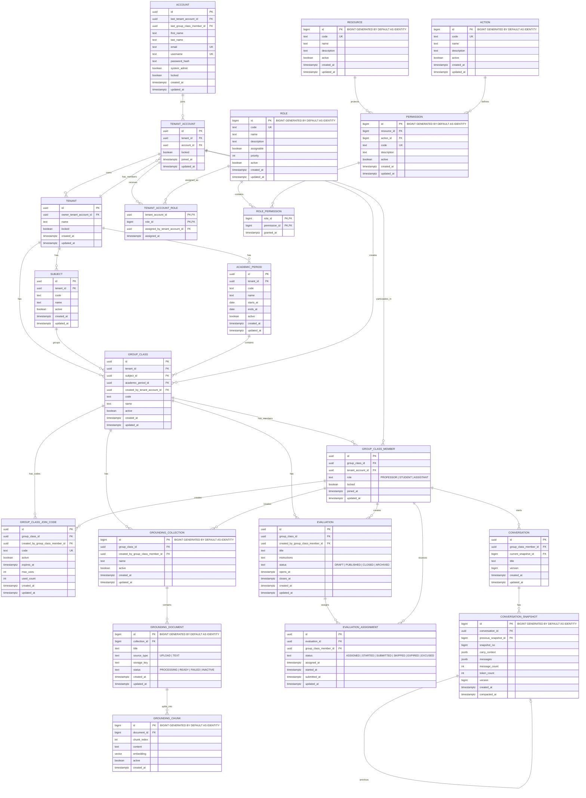

# UC-001: Migrate Schema to Academic Multi-Tenant Tutor ERD

---

**Goal:** As the development team, I want to migrate the current database schema from the existing `client_id`-centered tutor model to the target academic multi-tenant ERD so that accounts, tenants, academic structures, memberships, conversations, snapshots, grounding, evaluations, roles, and permissions are represented correctly as the new architectural foundation.

**Status:** Pending  
**Date:** 2026-06-20

---

## Scope

This use case covers the schema migration required to align the database with the target ERD.

This use case is intentionally limited to database structure, constraints, indexes, foundational seed data, and schema-level authorization foundations.

This use case includes:

- Adding the new `account` identity model.
- Adding `tenant` and `tenant_account`.
- Adding tenant-scoped role and permission tables.
- Adding a minimal RBAC authorization catalog based on real capability boundaries.
- Replacing the global `legacySubject` model with tenant-scoped subjects.
- Adding `academic_period`.
- Adding `group_class`.
- Adding `group_class_member`.
- Adding `group_class_join_code`.
- Introducing `conversation` as the new canonical replacement for `chat`.
- Introducing `conversation_snapshot` as the new snapshot and compaction model.
- Introducing `grounding_collection`, `grounding_document`, and `grounding_chunk`.
- Replacing the current global evaluation/evaluation-run model with group-class evaluations and assignments.
- Removing obsolete physical persistence from the baseline so only the target ERD is created.
- Isolating obsolete domain code from active Spring/JPA startup so the new ERD is the only active persistence model.

This use case does not include:

- Backward compatibility adapters.
- Full UI implementation.
- Full onboarding workflow implementation.
- Professor invitation runtime behavior.
- Student join-code runtime behavior.
- Full runtime authorization service implementation.
- Full migration of old development data into the new tables.
- Reintroducing obsolete legacy tables into the new baseline.
- Using obsolete legacy persistence in new flows.
- Adding `conversation_message`.
- Adding `evaluation_run` to the target ERD.
- Hardcoding PUCMM, ICC-101, academic periods, group classes, or professor/student memberships.
- Schools, departments, pensums, or deeper institutional hierarchy.

---

## Current Schema Being Replaced or Obsoleted

The current Flyway schema contains these major blocks:

```text
chat
chat_transcript
chat_message

student_profile
student_misconception
student_profile_signal

ingested_document
document_ingestion_job
document_segment
vector_store

legacySubject
subject_config_revision

evaluation
evaluation_run
```

The current schema is centered around:

```text
client_id
chat
chat_transcript
chat_message
student_profile
ingested_document
document_segment
vector_store
global legacySubject configuration
global evaluation
evaluation_run
```

The target ERD is centered around:

```text
account
tenant
tenant_account
tenant_account_role
role
resource
action
permission
role_permission

legacySubject
academic_period
group_class
group_class_member
group_class_join_code

conversation
conversation_snapshot

grounding_collection
grounding_document
grounding_chunk

evaluation
evaluation_assignment
```

---

## Target ERD Diagram

The following Mermaid diagram is the target ERD source of truth for this use case. It is included directly in the Markdown so it can be versioned, reviewed, and rendered by tools that support Mermaid.



---

## Identifier Strategy

The target ERD uses two identifier strategies:

```text
Business/domain boundary entities use UUID identifiers.
Internal catalog, snapshot, and selected implementation-detail entities use BIGINT identity identifiers where appropriate.
```

Use UUID for records that may be referenced across tenant boundaries, exposed as stable application identifiers, or used as ownership/security boundaries:

```text
account.id
tenant.id
tenant_account.id
legacySubject.id
academic_period.id
group_class.id
group_class_member.id
group_class_join_code.id
evaluation.id
evaluation_assignment.id
conversation.id
```

Use the following PostgreSQL identity form for internal records that do not need public UUID identifiers:

```sql
id BIGINT GENERATED BY DEFAULT AS IDENTITY PRIMARY KEY
```

This applies to internal/catalog/implementation tables such as:

```text
role.id
resource.id
action.id
permission.id
grounding_collection.id
grounding_document.id
grounding_chunk.id
conversation_snapshot.id
```

Join tables without their own surrogate identity keep their composite keys, but their foreign-key types must match the referenced tables. For example, `role_permission.role_id` and `role_permission.permission_id` are `BIGINT` because `role.id` and `permission.id` are `BIGINT`.

This keeps external/domain records safer and less predictable while keeping internal records simpler, smaller, and easier to read in database debugging.

---

## Important Legacy Decision

This migration adopts a clean baseline strategy.

```text
Obsolete tables are not created by the baseline.
Obsolete tables are not part of the target ERD.
Obsolete tables must not be used by new tutor flows.
Obsolete tables must not be used for authorization.
Obsolete tables must not be used for group-class membership.
Obsolete tables must not be used as the source of student identity.
```

The new source of truth for tutor conversations is:

```text
conversation
conversation_snapshot
```

Legacy code may remain in the repository for reference, but it must be excluded from active Spring/JPA startup until a later use case explicitly reactivates or replaces it.

---

## Legacy Code Organization Decision

To avoid confusing the new target schema with obsolete tables, all old model, repository, service, mapper, and migration-support code related to the obsolete tutor model must be moved or isolated under a clearly named legacy area.

Suggested package/folder direction:

```text
legacy/
  chat/
  student_profile/
  document_ingestion/
  evaluation_run/
```

Examples of legacy concepts:

```text
chat
chat_transcript
chat_message
student_profile
student_misconception
student_profile_signal
ingested_document
document_ingestion_job
document_segment
vector_store
subject_config_revision
evaluation_run
```

This means the new baseline and the active codebase must not present those tables as part of the active architecture.

The active domain should be organized around:

```text
account
tenant
authorization
academic
group_class
conversation
grounding
evaluation
```

---

## Target Conceptual Shift

The migration changes the system from this:

```text
client_id
  -> chat
      -> chat_transcript
          -> chat_message

client_id
  -> student_profile

client_id
  -> ingested_document
      -> document_segment
      -> vector_store

evaluation
  -> evaluation_run by student_client_id
```

To this:

```text
account
  -> tenant_account
      -> group_class_member
          -> conversation
              -> conversation_snapshot

group_class
  -> grounding_collection
      -> grounding_document
          -> grounding_chunk

group_class
  -> evaluation
      -> evaluation_assignment
```

The key identity chain becomes:

```text
ACCOUNT
  -> TENANT_ACCOUNT
      -> GROUP_CLASS_MEMBER
```

The key academic chain becomes:

```text
TENANT
  -> SUBJECT
  -> ACADEMIC_PERIOD
  -> GROUP_CLASS
      -> GROUP_CLASS_MEMBER
```

The key tutor activity chain becomes:

```text
GROUP_CLASS_MEMBER
  -> CONVERSATION
      -> CONVERSATION_SNAPSHOT
```

---

## Authorization Hierarchy Note

The authorization model follows a top-down hierarchy:

```text
SYSTEM_ADMIN
  -> TENANT_ADMIN
      -> PROFESSOR
          -> STUDENT
```

`SYSTEM_ADMIN` is the top of the hierarchy. The system admin can see and operate across all tenants, academic structures, group classes, members, conversations, grounding, evaluations, and assignments.

This hierarchy does not mean every role has all permissions from the role above. It means higher roles have broader administrative visibility and authority.

Expected meaning:

```text
SYSTEM_ADMIN:
- Global platform authority.
- Can create tenants.
- Can assign tenant admins.
- Can inspect the full platform.
- Can see all tenants and everything under them.

TENANT_ADMIN:
- Tenant-level academic authority.
- Can create subjects.
- Can create academic periods.
- Can create group classes.
- Can invite professors into group classes.
- Can manage academic structure inside their tenant.

PROFESSOR:
- Group-class operational authority.
- Can configure group-class information.
- Can invite students.
- Can update or logically remove group-class members when allowed.
- Can configure grounding documents.
- Can create evaluations.
- Can create evaluation assignments for students in their group class.
- Can view relevant student conversations according to future runtime rules.

STUDENT:
- Learner-level authority.
- Can access their group-class context.
- Can create and view their own conversations.
- Can view their assigned evaluations.
- Can update their own evaluation assignments as they start and submit them.
```

Runtime enforcement, scoping checks, and ownership checks are deferred to later use cases, but this use case must seed the roles, resources, actions, and permission catalog so that the hierarchy can be implemented correctly.

---

## Actors

- **Primary actor:** Development team
- **Secondary actors:** Migration Runner, Database, Tutor Application

---

## Preconditions

- The current database schema is represented by the existing Flyway baseline migration `V1__baseline.sql`.
- The team has agreed that `tenant` represents a university or academic institution.
- The team has agreed that `group_class` is the operational tutor workspace.
- The team has agreed that `chat` is no longer the canonical domain concept.
- The team has agreed that `conversation` is the new canonical domain concept.
- The team has agreed that `conversation_snapshot` stores compacted conversation state and messages.
- The team has agreed that the new baseline creates only the target ERD and omits obsolete legacy tables.
- The team has agreed that `evaluation_assignment` is part of the target ERD and can be directly interacted with by students.
- The team has agreed that assignment progress is represented through `EVALUATION_ASSIGNMENT:UPDATE`, not through a separate action or table.
- The team has agreed that only the initial system admin account may be seeded.
- The team has agreed that tenants, subjects, academic periods, group classes, tenant admins, professors, and students must be created later through onboarding/admin workflows.
- The application can accept a breaking schema migration.
- Backward compatibility is not required.

---

## Trigger

The development team begins the database migration required to align the current Socratic Tutor schema with the new academic multi-tenant ERD.

---

# Main Flow

---

## Stage 1: Add Account Identity Foundation

### Purpose

Replace the loose `client_id` identity assumption with a real authenticated identity table.

### Current State

The current schema uses `client_id` in several places:

```text
chat.client_id
student_profile.client_id
student_misconception.client_id
student_profile_signal.client_id
ingested_document.client_id
evaluation_run.student_client_id
```

### Target State

Create:

```text
account
```

Target schema:

```text
account
- id
- last_tenant_account_id
- last_group_class_member_id
- first_name
- last_name
- email
- username
- password_hash
- system_admin
- locked
- created_at
- updated_at
```

### Flow

1. **Development team** defines `account` as the root identity entity.
2. **Migration Runner** creates the `account` table.
3. **Database** enforces uniqueness on `email`.
4. **Database** enforces uniqueness on `username`.
5. **Database** allows `last_tenant_account_id` to be nullable during initial creation.
6. **Database** allows `last_group_class_member_id` to be nullable during initial creation.
7. **Migration Runner** seeds only the initial system admin account.
8. **Migration Runner** stores the seeded system admin password as a secure hash, not plaintext.

### Required Seed

```text
account:
- email: admin@socratic-tutor.com
- username: admin
- system_admin: true
- locked: false
- password_hash: configured secure hash for the initial admin password
```

The actual initial password must be configured through a safe development or deployment mechanism, not hardcoded as plaintext in the application.

### Result

```text
ACCOUNT becomes the root authenticated identity.
client_id is no longer the target identity model.
Students, professors, assistants, tenant admins, and system admins share the same identity root.
Only the initial platform system admin is seeded.
```

---

## Stage 2: Add Tenant and Tenant Account Foundation

### Purpose

Model the university/institution boundary.

### Current State

There is no target-aligned `tenant` model.

The current schema does not represent:

```text
university
tenant account
account inside tenant
tenant owner as tenant account
```

### Target State

Create:

```text
tenant
tenant_account
```

Target schema:

```text
tenant
- id
- owner_tenant_account_id
- name
- locked
- created_at
- updated_at
```

```text
tenant_account
- id
- tenant_id
- account_id
- locked
- joined_at
- updated_at
```

### Flow

1. **Development team** defines `tenant` as university or institution.
2. **Migration Runner** creates the `tenant` table.
3. **Migration Runner** creates the `tenant_account` table.
4. **Database** enforces that a tenant account references a valid tenant.
5. **Database** enforces that a tenant account references a valid account.
6. **Database** enforces uniqueness for `tenant_account(tenant_id, account_id)`.
7. **Migration Runner** adds the foreign key from `tenant.owner_tenant_account_id` to `tenant_account.id`.
8. **Migration Runner** adds the foreign keys from `account.last_tenant_account_id` and `account.last_group_class_member_id` later, after the referenced tables exist.

### Important Seed Decision

This use case must not seed PUCMM, ICC-101, academic periods, group classes, tenant admins, professors, or students.

Those records must be created later through dedicated onboarding/admin workflow use cases.

### Result

```text
TENANT means university/institution.
TENANT_ACCOUNT means account inside a tenant.
Tenant is no longer a professor-owned workspace.
No tenant is hardcoded by this migration.
```

---

## Stage 3: Add Minimal Role and Permission Foundation

### Purpose

Persist the authorization catalog required by the target ERD without treating every database table as a user-facing authorization resource.

This stage creates the authorization schema foundation, but it does not fully implement runtime permission enforcement. Runtime enforcement is deferred to later service-level use cases.

The goal is to support future permission checks such as:

```text
SYSTEM_ADMIN can see everything and create tenants.
SYSTEM_ADMIN can assign tenant admins.

TENANT_ADMIN can create subjects.
TENANT_ADMIN can create academic periods.
TENANT_ADMIN can create group classes.
TENANT_ADMIN can invite professors into group classes.

PROFESSOR can configure group-class information.
PROFESSOR can invite students.
PROFESSOR can update or logically remove group-class members.
PROFESSOR can generate join codes.
PROFESSOR can configure grounding documents.
PROFESSOR can create evaluations.
PROFESSOR can assign evaluations to students.
PROFESSOR can view relevant conversations according to future runtime rules.

STUDENT can view group-class context.
STUDENT can create and view their own conversations.
STUDENT can view and update their own evaluation assignments as they start and submit them.
```

### Current State

The current schema does not contain:

```text
role
resource
action
permission
role_permission
tenant_account_role
```

The current schema also does not have a persisted authorization catalog for academic multi-tenancy.

### Target State

Create:

```text
role
resource
action
permission
role_permission
tenant_account_role
```

Target schema:

```text
role
- id BIGINT GENERATED BY DEFAULT AS IDENTITY PRIMARY KEY
- code
- name
- description
- assignable
- priority
- active
- created_at
- updated_at
```

```text
resource
- id BIGINT GENERATED BY DEFAULT AS IDENTITY PRIMARY KEY
- code
- name
- description
- active
- created_at
- updated_at
```

```text
action
- id BIGINT GENERATED BY DEFAULT AS IDENTITY PRIMARY KEY
- code
- name
- description
- active
- created_at
- updated_at
```

```text
permission
- id BIGINT GENERATED BY DEFAULT AS IDENTITY PRIMARY KEY
- resource_id BIGINT FK
- action_id BIGINT FK
- code
- description
- active
- created_at
- updated_at
```

```text
role_permission
- role_id BIGINT PK,FK
- permission_id BIGINT PK,FK
- granted_at
```

```text
tenant_account_role
- tenant_account_id UUID PK,FK
- role_id BIGINT PK,FK
- assigned_by_tenant_account_id UUID FK
- assigned_at
```

### Flow

1. **Migration Runner** creates `role`.
2. **Migration Runner** creates `resource`.
3. **Migration Runner** creates `action`.
4. **Migration Runner** creates `permission`.
5. **Migration Runner** creates `role_permission`.
6. **Migration Runner** creates `tenant_account_role`.
7. **Database** enforces uniqueness on `role.code`.
8. **Database** enforces uniqueness on `resource.code`.
9. **Database** enforces uniqueness on `action.code`.
10. **Database** enforces uniqueness on `permission.code`.
11. **Database** enforces composite primary keys for `role_permission` and `tenant_account_role`.
12. **Migration Runner** seeds the minimal roles required by the academic tenant model.
13. **Migration Runner** seeds only user-facing or policy-relevant resources.
14. **Migration Runner** seeds only simple CRUD/invitation actions needed by the current access model.
15. **Migration Runner** does not seed internal implementation tables as authorization resources.

### Required Seed Data

Roles:

```text
SYSTEM_ADMIN
TENANT_ADMIN
PROFESSOR
STUDENT
ASSISTANT
```

Resources:

```text
TENANT
SUBJECT
ACADEMIC_PERIOD
GROUP_CLASS
GROUP_CLASS_MEMBER
GROUP_CLASS_JOIN_CODE
GROUNDING
EVALUATION
EVALUATION_ASSIGNMENT
CONVERSATION
```

Actions:

```text
VIEW
CREATE
UPDATE
DELETE
INVITE
```

### Authorization Hierarchy

The roles follow this conceptual hierarchy:

```text
SYSTEM_ADMIN
  -> TENANT_ADMIN
      -> PROFESSOR
          -> STUDENT
```

`SYSTEM_ADMIN` is the top of the permission pyramid and may see everything across the platform.

`TENANT_ADMIN` operates inside a tenant.

`PROFESSOR` operates inside group classes where the professor is an active group-class member.

`STUDENT` operates only inside group classes where the student is an active group-class member and only over the student's own conversations and evaluation assignments.

### Resource Rationale

The authorization catalog must not blindly mirror the database schema.

A `resource` represents a user-facing or policy-relevant capability boundary, not every table in the ERD.

For this reason, the following resources are included:

| Resource | Meaning |
|---------|---------|
| `TENANT` | University/institution administration. Used by `SYSTEM_ADMIN` to create, view, or update tenants. |
| `SUBJECT` | Academic legacySubject management inside a tenant. Used by `TENANT_ADMIN`. |
| `ACADEMIC_PERIOD` | Academic period management inside a tenant. Used by `TENANT_ADMIN`. |
| `GROUP_CLASS` | Concrete class section management. Used by `TENANT_ADMIN`, and partially by `PROFESSOR` depending on later rules. |
| `GROUP_CLASS_MEMBER` | Membership and invitation management for professors, students, and assistants. Professors may update or logically remove members inside their own group classes. |
| `GROUP_CLASS_JOIN_CODE` | Access-code generation and control for students joining a group class. |
| `GROUNDING` | Group-class grounding configuration, including uploaded/text documents and generated chunks. |
| `EVALUATION` | Group-class evaluation creation, publishing, and management. |
| `EVALUATION_ASSIGNMENT` | Student-facing assigned evaluation state. Students can view and update their own assignments as they start and submit them. |
| `CONVERSATION` | Tutor conversations owned by group-class members. |

### Internal Tables Excluded from Resources

These tables exist in the schema but are not seeded as authorization resources in this use case:

```text
TENANT_ACCOUNT
ROLE_PERMISSION
PERMISSION
RESOURCE
ACTION
CONVERSATION_SNAPSHOT
GROUNDING_COLLECTION
GROUNDING_DOCUMENT
GROUNDING_CHUNK
```

Reason:

```text
They are implementation or relationship tables.
Users do not operate them directly as standalone application capabilities.
Access to them is controlled through higher-level resources.
```

Higher-level control mapping:

```text
TENANT controls tenant-level administration.
GROUP_CLASS_MEMBER controls professor/student membership operations.
CONVERSATION controls access to conversation snapshots.
GROUNDING controls access to grounding collections, documents, and chunks.
EVALUATION controls evaluation definitions.
EVALUATION_ASSIGNMENT controls student-facing assigned evaluation progress.
```

### Action Rationale

| Action | Meaning |
|--------|---------|
| `VIEW` | Read, list, or open the resource. |
| `CREATE` | Create a new instance of the resource. |
| `UPDATE` | Modify an existing resource or transition its state. For `EVALUATION_ASSIGNMENT`, this covers moving from `ASSIGNED` to `STARTED` or `SUBMITTED`. |
| `DELETE` | Remove, archive, or logically disable a resource where allowed. For `GROUP_CLASS_MEMBER`, this means disabling/removing the member from active use, not necessarily physically deleting the row. |
| `INVITE` | Invite or assign another person into a tenant or group-class context. |

### Expected Permission Direction

The migration may seed permissions from the allowed resource/action combinations, but the final runtime enforcement, ownership checks, and scope checks are deferred to later use cases.

```text
SYSTEM_ADMIN
- TENANT:VIEW
- TENANT:CREATE
- TENANT:UPDATE

- SUBJECT:VIEW
- ACADEMIC_PERIOD:VIEW
- GROUP_CLASS:VIEW
- GROUP_CLASS_MEMBER:VIEW
- GROUP_CLASS_JOIN_CODE:VIEW
- GROUNDING:VIEW
- EVALUATION:VIEW
- EVALUATION_ASSIGNMENT:VIEW
- CONVERSATION:VIEW
```

The system admin is at the top of the hierarchy and can see all platform data, even when specific create/update responsibilities are normally delegated to lower roles.

```text
TENANT_ADMIN
- SUBJECT:VIEW
- SUBJECT:CREATE
- SUBJECT:UPDATE
- SUBJECT:DELETE

- ACADEMIC_PERIOD:VIEW
- ACADEMIC_PERIOD:CREATE
- ACADEMIC_PERIOD:UPDATE
- ACADEMIC_PERIOD:DELETE

- GROUP_CLASS:VIEW
- GROUP_CLASS:CREATE
- GROUP_CLASS:UPDATE
- GROUP_CLASS:DELETE

- GROUP_CLASS_MEMBER:VIEW
- GROUP_CLASS_MEMBER:INVITE
- GROUP_CLASS_MEMBER:UPDATE
- GROUP_CLASS_MEMBER:DELETE
```

```text
PROFESSOR
- GROUP_CLASS:VIEW
- GROUP_CLASS:UPDATE

- GROUP_CLASS_MEMBER:VIEW
- GROUP_CLASS_MEMBER:INVITE
- GROUP_CLASS_MEMBER:UPDATE
- GROUP_CLASS_MEMBER:DELETE

- GROUP_CLASS_JOIN_CODE:VIEW
- GROUP_CLASS_JOIN_CODE:CREATE
- GROUP_CLASS_JOIN_CODE:UPDATE
- GROUP_CLASS_JOIN_CODE:DELETE

- GROUNDING:VIEW
- GROUNDING:CREATE
- GROUNDING:UPDATE
- GROUNDING:DELETE

- EVALUATION:VIEW
- EVALUATION:CREATE
- EVALUATION:UPDATE
- EVALUATION:DELETE

- EVALUATION_ASSIGNMENT:VIEW
- EVALUATION_ASSIGNMENT:CREATE
- EVALUATION_ASSIGNMENT:UPDATE
- EVALUATION_ASSIGNMENT:DELETE

- CONVERSATION:VIEW
```

```text
STUDENT
- GROUP_CLASS:VIEW

- CONVERSATION:VIEW
- CONVERSATION:CREATE
- CONVERSATION:UPDATE
- CONVERSATION:DELETE

- EVALUATION:VIEW

- EVALUATION_ASSIGNMENT:VIEW
- EVALUATION_ASSIGNMENT:UPDATE
```

### Important Clarification About `EVALUATION_ASSIGNMENT:UPDATE`

The target ERD does not include `evaluation_run`.

When a professor assigns an evaluation to a group class, each student receives an `evaluation_assignment`.

The student starts and completes the assigned evaluation by updating their own `evaluation_assignment` state.

Expected lifecycle:

```text
ASSIGNED -> STARTED -> SUBMITTED
```

Other supported outcomes:

```text
SKIPPED
EXPIRED
EXCUSED
```

The detailed behavior for starting, answering, submitting, expiring, or excusing an assignment belongs to a later evaluation runtime use case.

### Important Clarification About `GROUP_CLASS_MEMBER:DELETE`

`GROUP_CLASS_MEMBER:DELETE` does not require physical deletion.

In this schema, removing a member should be interpreted as logical removal, disabling, or locking unless a later use case explicitly allows hard deletion.

For the current ERD, the safest interpretation is:

```text
group_class_member.locked = true
```

or an equivalent logical removal approach if the schema later adds a status column.

### Result

```text
The schema can represent tenant-scoped roles and permissions.
Resources represent real policy boundaries, not every database table.
Actions remain explicit and minimal.
SYSTEM_ADMIN is the top of the hierarchy and can see everything.
EVALUATION_ASSIGNMENT is included because students directly interact with assignments.
Students progress through evaluation assignments using UPDATE.
Runtime authorization enforcement is outside this use case.
```

---

## Stage 4: Replace Global Subject Model with Tenant-Scoped Academic Structure

### Purpose

Replace the current global legacySubject/config model with the academic structure from the ERD.

### Current State

Current `legacySubject`:

```text
legacySubject
- id
- slug
- display_name
- status
- current_config_revision_id
- config_version
- lock_version
- created_at
- updated_at
```

Current `subject_config_revision`:

```text
subject_config_revision
- id
- subject_id
- version
- config
- rubric_defaults
- question_policy
- created_by
- created_at
```

Current seed:

```text
slug: introduccion-algoritmia
display_name: Introducción a la Algoritmia
```

### Target State

Create or redefine:

```text
legacySubject
academic_period
group_class
```

Target `legacySubject`:

```text
legacySubject
- id
- tenant_id
- code
- name
- active
- created_at
- updated_at
```

Target `academic_period`:

```text
academic_period
- id
- tenant_id
- code
- name
- starts_at
- ends_at
- active
- created_at
- updated_at
```

Target `group_class`:

```text
group_class
- id
- tenant_id
- subject_id
- academic_period_id
- created_by_tenant_account_id
- code
- name
- active
- created_at
- updated_at
```

### Flow

1. **Migration Runner** replaces or recreates `legacySubject` with the target ERD structure.
2. **Migration Runner** stops using `subject_config_revision` for the target schema.
3. **Migration Runner** creates `academic_period`.
4. **Migration Runner** creates `group_class`.
5. **Database** enforces that each legacySubject belongs to a tenant.
6. **Database** enforces that each academic period belongs to a tenant.
7. **Database** enforces that each group class belongs to a tenant, legacySubject, and academic period.
8. **Database** enforces that each group class has a `created_by_tenant_account_id`.

### Seed Decision

This use case does not seed any tenant, legacySubject, academic period, or group class.

Those records will be created and tested in later workflow use cases:

```text
System admin creates tenant.
System admin assigns tenant admin.
Tenant admin creates academic periods.
Tenant admin creates subjects.
Tenant admin creates group classes.
Tenant admin invites professor.
Professor configures group class and invites students.
```

### Result

```text
Subject is no longer global.
Subject belongs to tenant.
Group class becomes the concrete academic workspace.
No academic domain data is hardcoded by this migration.
```

---

## Stage 5: Add Group-Class Membership

### Purpose

Represent professors, students, and assistants inside concrete class groups.

### Current State

The current schema does not have:

```text
group_class_member
```

The current schema uses `client_id` instead of academic membership.

### Target State

Create:

```text
group_class_member
```

Target schema:

```text
group_class_member
- id
- group_class_id
- tenant_account_id
- role
- locked
- joined_at
- updated_at
```

Allowed role values:

```text
PROFESSOR
STUDENT
ASSISTANT
```

### Flow

1. **Migration Runner** creates `group_class_member`.
2. **Database** enforces that each member belongs to a valid group class.
3. **Database** enforces that each member references a valid tenant account.
4. **Database** enforces that the role is one of `PROFESSOR`, `STUDENT`, or `ASSISTANT`.
5. **Database** enforces uniqueness for group-class membership where appropriate.

### Result

```text
Professor and student are not separate identity roots.
Professor and student are not direct children of legacySubject.
Professor and student are roles inside group_class_member.
```

---

## Stage 6: Add Group-Class Join Code

### Purpose

Represent the schema for group-class access codes.

### Current State

The current schema does not have group-class join codes.

### Target State

Create:

```text
group_class_join_code
```

Target schema:

```text
group_class_join_code
- id
- group_class_id
- created_by_group_class_member_id
- code
- active
- expires_at
- max_uses
- used_count
- created_at
- updated_at
```

### Flow

1. **Migration Runner** creates `group_class_join_code`.
2. **Database** enforces that each join code belongs to a valid group class.
3. **Database** enforces that each join code was created by a valid group-class member.
4. **Database** enforces uniqueness on `code`.

### Result

```text
The schema can represent a reusable access code for a group class.
The behavior for students joining by code is outside this use case.
```

---

## Stage 7: Add Conversation and Conversation Snapshot

### Purpose

Introduce the new canonical conversation model and replace `chat` conceptually.

### Current State

Current chat model:

```text
chat
- id
- client_id
- title
- current_transcript_id
- created_at
- updated_at
```

```text
chat_transcript
- id
- chat_id
- memory
- input_tokens
- compacted_from_transcript_id
- compaction_level
- created_at
```

```text
chat_message
- id
- transcript_id
- role
- content
- metadata
- created_at
```

### Target State

Create:

```text
conversation
conversation_snapshot
```

Target `conversation`:

```text
conversation
- id UUID PRIMARY KEY
- group_class_member_id UUID FK
- current_snapshot_id BIGINT FK
- title
- version
- created_at
- updated_at
```

Target `conversation_snapshot`:

```text
conversation_snapshot
- id BIGINT GENERATED BY DEFAULT AS IDENTITY PRIMARY KEY
- conversation_id UUID FK
- previous_snapshot_id BIGINT FK
- snapshot_no
- carry_context
- messages
- message_count
- token_count
- version
- created_at
- compacted_at
```

### Mapping

```text
chat                          -> legacy obsolete
chat_transcript                -> legacy obsolete
chat_message                   -> legacy obsolete

conversation                   -> new canonical chat replacement
conversation_snapshot          -> new transcript/message/compaction replacement

chat.current_transcript_id     -> conversation.current_snapshot_id
chat_transcript.memory         -> conversation_snapshot.carry_context
chat_transcript.input_tokens   -> conversation_snapshot.token_count
chat_transcript.compacted_from_transcript_id -> conversation_snapshot.previous_snapshot_id
chat_message rows              -> conversation_snapshot.messages
```

### Flow

1. **Migration Runner** creates `conversation`.
2. **Migration Runner** creates `conversation_snapshot`.
3. **Database** enforces that each conversation belongs to a valid group-class member.
4. **Database** enforces that each snapshot belongs to a valid conversation.
5. **Database** allows each snapshot to optionally reference a previous snapshot.
6. **Database** allows each conversation to optionally reference its current snapshot.
7. **Database** does not create a separate `conversation_message` table because the ERD stores messages in `conversation_snapshot.messages`.

### Result

```text
conversation is the new source of truth.
conversation_snapshot stores the compacted context and messages.
chat/chat_transcript/chat_message remain legacy obsolete and are not used by new flows.
```

---

## Stage 8: Add Grounding Schema

### Purpose

Replace the current document ingestion model with group-class grounding.

### Current State

Current document model:

```text
ingested_document
document_ingestion_job
document_segment
vector_store
```

Current meaning:

```text
Documents are tied to client_id.
Segments and embeddings are separate from the academic group-class model.
```

### Target State

Create:

```text
grounding_collection
grounding_document
grounding_chunk
```

Target `grounding_collection`:

```text
grounding_collection
- id BIGINT GENERATED BY DEFAULT AS IDENTITY PRIMARY KEY
- group_class_id UUID FK
- created_by_group_class_member_id UUID FK
- name
- active
- created_at
- updated_at
```

Target `grounding_document`:

```text
grounding_document
- id BIGINT GENERATED BY DEFAULT AS IDENTITY PRIMARY KEY
- collection_id BIGINT FK
- title
- source_type
- storage_key
- status
- created_at
- updated_at
```

Allowed `grounding_document.source_type` values:

```text
UPLOAD
TEXT
```

Allowed `grounding_document.status` values:

```text
PROCESSING
READY
FAILED
INACTIVE
```

Target `grounding_chunk`:

```text
grounding_chunk
- id BIGINT GENERATED BY DEFAULT AS IDENTITY PRIMARY KEY
- document_id BIGINT FK
- chunk_index
- content
- embedding
- active
- created_at
```

### Mapping

```text
ingested_document       -> legacy obsolete / conceptually replaced by grounding_document
document_segment        -> legacy obsolete / conceptually replaced by grounding_chunk
vector_store            -> legacy obsolete / conceptually replaced by grounding_chunk.embedding
document_ingestion_job  -> legacy obsolete / no target ERD equivalent
```

### Flow

1. **Migration Runner** creates `grounding_collection`.
2. **Migration Runner** creates `grounding_document`.
3. **Migration Runner** creates `grounding_chunk`.
4. **Database** enforces that each grounding collection belongs to a group class.
5. **Database** enforces that each grounding collection was created by a group-class member.
6. **Database** enforces that each grounding document belongs to a grounding collection.
7. **Database** enforces that each grounding chunk belongs to a grounding document.
8. **Database** supports vector embeddings directly in `grounding_chunk.embedding`.

### Result

```text
Grounding is now group-class scoped.
Documents belong to grounding collections.
Chunks belong to grounding documents.
Embeddings live directly on grounding chunks.
```

---

## Stage 9: Replace Evaluation Run Model with Group-Class Evaluation Assignment Model

### Purpose

Replace the current global evaluation/execution model with the ERD evaluation model.

### Current State

Current `evaluation`:

```text
evaluation
- id
- title
- instruction
- questions_json
- answers_json
- report_markdown
- status
- created_at
- updated_at
```

Current `evaluation_run`:

```text
evaluation_run
- id
- evaluation_id
- student_client_id
- questions_asked_json
- answers_given_json
- report_markdown
- status
- created_at
- updated_at
```

### Target State

Create or redefine:

```text
evaluation
evaluation_assignment
```

Target `evaluation`:

```text
evaluation
- id
- group_class_id
- created_by_group_class_member_id
- title
- instructions
- status
- opens_at
- closes_at
- created_at
- updated_at
```

Allowed `evaluation.status` values:

```text
DRAFT
PUBLISHED
CLOSED
ARCHIVED
```

Target `evaluation_assignment`:

```text
evaluation_assignment
- id
- evaluation_id
- group_class_member_id
- status
- assigned_at
- started_at
- submitted_at
- updated_at
```

Allowed `evaluation_assignment.status` values:

```text
ASSIGNED
STARTED
SUBMITTED
SKIPPED
EXPIRED
EXCUSED
```

### Mapping

```text
evaluation.status PENDING/RUNNING/COMPLETED/FAILED -> replaced by DRAFT/PUBLISHED/CLOSED/ARCHIVED

evaluation.instruction       -> evaluation.instructions
evaluation.questions_json    -> no target ERD equivalent
evaluation.answers_json      -> no target ERD equivalent
evaluation.report_markdown   -> no target ERD equivalent

evaluation_run               -> legacy obsolete / conceptually replaced by evaluation_assignment
evaluation_run.student_client_id -> evaluation_assignment.group_class_member_id
evaluation_run.status        -> evaluation_assignment.status
```

### Flow

1. **Migration Runner** replaces or recreates `evaluation` using the ERD structure.
2. **Migration Runner** creates `evaluation_assignment`.
3. **Database** enforces that each evaluation belongs to a group class.
4. **Database** enforces that each evaluation was created by a group-class member.
5. **Database** enforces that each evaluation assignment belongs to an evaluation.
6. **Database** enforces that each evaluation assignment targets a group-class member.
7. **Database** does not create `evaluation_run` because it is not part of the target ERD.

### Evaluation Assignment Meaning

When a professor creates an evaluation for a group class, the system can assign that evaluation to students in the group class.

Each student receives an `evaluation_assignment`.

The student does not run an `evaluation_run` record. The student progresses through their own `evaluation_assignment`.

Expected assignment lifecycle:

```text
ASSIGNED
  -> STARTED
      -> SUBMITTED
```

Other supported outcomes:

```text
SKIPPED
EXPIRED
EXCUSED
```

### Result

```text
Evaluation is group-class scoped.
Evaluation is created by a professor group-class member.
Evaluation assignment targets a student group-class member.
Evaluation assignment represents a student's assigned evaluation state.
evaluation_run is no longer part of the target schema.
EVALUATION_ASSIGNMENT:UPDATE represents assignment progress, not a separate run table.
```

---

## Stage 10: Mark Legacy Tables as Obsolete

### Purpose

Remove obsolete persistence from the baseline and isolate obsolete code from active startup.

### Legacy Tables Removed From Baseline

The following obsolete tables are not created by the baseline:

```text
student_profile
student_misconception
student_profile_signal
chat
chat_transcript
chat_message
ingested_document
document_ingestion_job
document_segment
vector_store
legacy_subject
legacy_subject_config_revision
legacy_evaluation
legacy_evaluation_run
```

### Flow

1. **Development team** documents the obsolete tables as out of scope for the new baseline.
2. **Development team** excludes obsolete JPA entities and repositories from active startup.
3. **Development team** excludes obsolete services, tools, and UI flows that still depend on obsolete persistence from active startup.
4. **Development team** ensures new code uses `conversation` and `conversation_snapshot`.
5. **Development team** ensures new code uses `grounding_*` instead of the old document ingestion model.
6. **Development team** ensures new code uses `evaluation` and `evaluation_assignment` instead of `evaluation_run`.

### Result

```text
Old legacy tables are absent from the baseline.
Legacy code is isolated from active Spring/JPA startup.
New architecture uses account, tenant, group_class_member, conversation, grounding, evaluation, and evaluation_assignment.
```

---

## Stage 11: Apply Constraints, Indexes, and Seeds

### Purpose

Make the new ERD enforceable and usable.

### Required Constraints

```text
account.email unique
account.username unique

tenant_account(tenant_id, account_id) unique

role.id BIGINT identity primary key
resource.id BIGINT identity primary key
action.id BIGINT identity primary key
permission.id BIGINT identity primary key
role.code unique
resource.code unique
action.code unique
permission.code unique

role_permission(role_id BIGINT, permission_id BIGINT) primary key
tenant_account_role(tenant_account_id UUID, role_id BIGINT) primary key

legacySubject(tenant_id, code) unique
academic_period(tenant_id, code) unique
group_class(tenant_id, code) unique

group_class_member(group_class_id, tenant_account_id, role) unique

group_class_join_code.code unique

grounding_chunk(document_id, chunk_index) unique

evaluation_assignment(evaluation_id, group_class_member_id) unique

conversation_snapshot(conversation_id, snapshot_no) unique

Internal identity columns use:
- role.id BIGINT GENERATED BY DEFAULT AS IDENTITY PRIMARY KEY
- resource.id BIGINT GENERATED BY DEFAULT AS IDENTITY PRIMARY KEY
- action.id BIGINT GENERATED BY DEFAULT AS IDENTITY PRIMARY KEY
- permission.id BIGINT GENERATED BY DEFAULT AS IDENTITY PRIMARY KEY
- grounding_collection.id BIGINT GENERATED BY DEFAULT AS IDENTITY PRIMARY KEY
- grounding_document.id BIGINT GENERATED BY DEFAULT AS IDENTITY PRIMARY KEY
- grounding_chunk.id BIGINT GENERATED BY DEFAULT AS IDENTITY PRIMARY KEY
- conversation_snapshot.id BIGINT GENERATED BY DEFAULT AS IDENTITY PRIMARY KEY
```

### Recommended Indexes

```text
tenant_account.tenant_id
tenant_account.account_id

tenant_account_role.tenant_account_id
tenant_account_role.role_id

legacySubject.tenant_id
academic_period.tenant_id

group_class.tenant_id
group_class.subject_id
group_class.academic_period_id

group_class_member.group_class_id
group_class_member.tenant_account_id

group_class_join_code.group_class_id
group_class_join_code.code

conversation.group_class_member_id
conversation.current_snapshot_id

conversation_snapshot.conversation_id
conversation_snapshot.previous_snapshot_id

grounding_collection.group_class_id
grounding_document.collection_id
grounding_chunk.document_id

evaluation.group_class_id
evaluation.created_by_group_class_member_id
evaluation_assignment.evaluation_id
evaluation_assignment.group_class_member_id
```

### Required Seed Data

The migration must seed only foundational authorization data and the initial platform system admin account.

Seed account:

```text
account:
- email: admin@socratic-tutor.com
- username: admin
- system_admin: true
- locked: false
- password_hash: configured secure hash for the initial admin password
```

Seed roles:

```text
SYSTEM_ADMIN
TENANT_ADMIN
PROFESSOR
STUDENT
ASSISTANT
```

Seed resources:

```text
TENANT
SUBJECT
ACADEMIC_PERIOD
GROUP_CLASS
GROUP_CLASS_MEMBER
GROUP_CLASS_JOIN_CODE
GROUNDING
EVALUATION
EVALUATION_ASSIGNMENT
CONVERSATION
```

Seed actions:

```text
VIEW
CREATE
UPDATE
DELETE
INVITE
```

### Data Not Seeded in This Use Case

This use case must not seed:

```text
PUCMM tenant
ICC-101 legacySubject
academic periods
group classes
tenant admin accounts
professor accounts
student accounts
professor memberships
student memberships
grounding collections
evaluations
evaluation assignments
conversations
```

These records must be created by later workflow use cases.

Expected later workflow:

```text
1. System admin logs in.
2. System admin creates a tenant.
3. System admin assigns a tenant admin.
4. Tenant admin creates academic periods.
5. Tenant admin creates subjects.
6. Tenant admin creates group classes.
7. Tenant admin invites professors.
8. Professor configures group class.
9. Professor uploads grounding documents.
10. Professor invites students.
11. Professor creates evaluations.
12. Students receive and update evaluation assignments as they start and submit them.
```

The following internal tables must not be seeded as authorization resources in this use case:

```text
TENANT_ACCOUNT
ROLE_PERMISSION
PERMISSION
RESOURCE
ACTION
CONVERSATION_SNAPSHOT
GROUNDING_COLLECTION
GROUNDING_DOCUMENT
GROUNDING_CHUNK
```

### Result

```text
The target ERD exists with constraints, indexes, foundational RBAC seed data, and a single initial system admin account.
No academic tenant, legacySubject, period, group, professor, student, or thesis-specific structure is hardcoded.
```

---

## Alternative Flows

### AF-1: Existing table conflicts with target table

**Branches from:** Any stage  
**Condition:** A table already exists with the same name but incompatible columns.

1. **Migration Runner** stops the migration.
2. **Development team** decides whether to drop, rename, or recreate the conflicting table.
3. Use case ends until the conflict is resolved.

---

### AF-2: Obsolete startup dependency still reaches legacy persistence

**Branches from:** Stage 10  
**Condition:** A Spring bean, repository, entity scan, or UI flow still requires an obsolete table during startup.

1. **Development team** disables or excludes the obsolete startup dependency from the active application context.
2. **Development team** keeps the clean baseline focused on the target ERD only.
3. **Development team** documents the excluded legacy area for later replacement or reactivation.
4. Use case continues.

---

### AF-3: Required seed data already exists

**Branches from:** Stage 11  
**Condition:** A role, resource, action, permission, or system admin account already exists.

1. **Migration Runner** uses idempotent seed logic where appropriate.
2. **Database** avoids duplicate seed records.
3. Use case continues.

---

### AF-4: Constraint cannot be applied

**Branches from:** Stage 11  
**Condition:** Existing rows violate a required foreign key or unique constraint.

1. **Migration Runner** stops before applying the constraint.
2. **Development team** corrects, clears, or reseeds the conflicting data.
3. **Migration Runner** reruns the stage.
4. Use case continues.

---

### AF-5: Runtime permission meaning is not fully implemented yet

**Branches from:** Stage 3 or Stage 11  
**Condition:** The schema can represent a permission, but runtime enforcement has not been implemented.

1. **Development team** keeps the permission seed as schema-level foundation only.
2. **Development team** does not claim runtime authorization is complete.
3. **Development team** defers enforcement to a later authorization/runtime use case.
4. Use case continues.

---

## Postconditions

- **On success:** The database contains the target academic multi-tenant ERD. `account`, `tenant`, `tenant_account`, roles, permissions, `legacySubject`, `academic_period`, `group_class`, `group_class_member`, `group_class_join_code`, `conversation`, `conversation_snapshot`, `grounding_collection`, `grounding_document`, `grounding_chunk`, `evaluation`, and `evaluation_assignment` exist with required relationships, constraints, indexes, foundational RBAC data, and one initial system admin account.

- **On failure:** The migration stops at the failing stage. The target schema must not be considered complete. The development team must resolve the schema conflict, dependency issue, or constraint violation before proceeding.

---

## Business Rules

| ID | Rule |
|----|------|
| BR-01 | This use case is limited to schema migration, schema-level RBAC foundation, constraints, indexes, and seed data. |
| BR-02 | Backward compatibility is out of scope. |
| BR-03 | Full runtime service behavior is out of scope. |
| BR-04 | UI behavior is out of scope. |
| BR-05 | `account` is the root authenticated identity table. |
| BR-06 | `client_id` is not part of the target identity model. |
| BR-07 | `tenant` represents a university or academic institution. |
| BR-08 | `tenant` must not represent a professor-owned workspace. |
| BR-09 | `tenant_account` connects an account to a tenant. |
| BR-10 | Roles are assigned through `tenant_account_role`, not directly to global accounts. |
| BR-11 | The role hierarchy is `SYSTEM_ADMIN -> TENANT_ADMIN -> PROFESSOR -> STUDENT`. |
| BR-12 | `SYSTEM_ADMIN` is the highest role and can see all platform data. |
| BR-13 | `SYSTEM_ADMIN` can create tenants and assign tenant admins in later workflow use cases. |
| BR-14 | `TENANT_ADMIN` operates inside a tenant. |
| BR-15 | `PROFESSOR` operates inside group classes where the professor is an active group-class member. |
| BR-16 | `STUDENT` operates inside group classes where the student is an active group-class member. |
| BR-17 | `legacySubject` belongs to a tenant. |
| BR-18 | `academic_period` belongs to a tenant. |
| BR-19 | `group_class` belongs to a tenant, legacySubject, and academic period. |
| BR-20 | `group_class_member` connects a tenant account to a group class. |
| BR-21 | Professor, student, and assistant are group-class member roles. |
| BR-22 | `group_class_join_code` belongs to a group class. |
| BR-23 | `group_class_join_code` is created by a group-class member. |
| BR-24 | `conversation` replaces `chat` as the canonical tutor conversation model. |
| BR-25 | `conversation` belongs to a group-class member. |
| BR-26 | `conversation.current_snapshot_id` points to the current conversation snapshot. |
| BR-27 | `conversation_snapshot` belongs to a conversation. |
| BR-28 | `conversation_snapshot.previous_snapshot_id` may point to a previous snapshot. |
| BR-29 | Messages are stored in `conversation_snapshot.messages`, not in a separate target `conversation_message` table. |
| BR-30 | Compacted context is stored in `conversation_snapshot.carry_context`. |
| BR-31 | `grounding_collection` belongs to a group class. |
| BR-32 | `grounding_collection` is created by a group-class member. |
| BR-33 | `grounding_document` belongs to a grounding collection. |
| BR-34 | `grounding_chunk` belongs to a grounding document. |
| BR-35 | Embeddings are stored on `grounding_chunk.embedding`. |
| BR-36 | `evaluation` belongs to a group class. |
| BR-37 | `evaluation` is created by a professor group-class member. |
| BR-38 | `evaluation_assignment` belongs to an evaluation. |
| BR-39 | `evaluation_assignment` targets a student group-class member. |
| BR-40 | `evaluation_run` is not part of the target ERD. |
| BR-41 | `student_profile`, `student_misconception`, and `student_profile_signal` are obsolete and are not created by the UC-001 baseline. |
| BR-42 | New code must not read or write the obsolete student profile block. |
| BR-43 | The obsolete student profile block must not be used to infer identity, membership, permissions, or tutor context. |
| BR-44 | Old `chat`, `chat_transcript`, and `chat_message` are obsolete and are not created by the UC-001 baseline. |
| BR-45 | New code must not use old `chat`, `chat_transcript`, or `chat_message` as the conversation source of truth. |
| BR-46 | Legacy code that still depends on obsolete persistence must be isolated from active Spring/JPA startup. |
| BR-47 | The target schema must not introduce `conversation_message` unless a later ERD revision explicitly adds it. |
| BR-48 | The target schema must not introduce `evaluation_run` unless a later ERD revision explicitly adds it. |
| BR-49 | Schools, departments, pensums, onboarding flows, invitation behavior, and full runtime authorization enforcement are out of scope. |
| BR-50 | Authorization resources must represent user-facing or policy-relevant capability boundaries, not every database table. |
| BR-51 | Internal implementation tables must not be seeded as authorization resources unless a later use case requires direct policy control over them. |
| BR-52 | `TENANT` is a valid resource because `SYSTEM_ADMIN` needs to create, view, or update tenants. |
| BR-53 | `SUBJECT` is a valid resource because `TENANT_ADMIN` needs to create and maintain tenant-scoped subjects. |
| BR-54 | `ACADEMIC_PERIOD` is a valid resource because `TENANT_ADMIN` needs to create and maintain tenant-scoped academic periods. |
| BR-55 | `GROUP_CLASS` is a valid resource because `TENANT_ADMIN` creates group classes and professors may later update group-class information. |
| BR-56 | `GROUP_CLASS_MEMBER` is a valid resource because tenant admins and professors need controlled membership and invitation operations. |
| BR-57 | `GROUP_CLASS_JOIN_CODE` is a valid resource because professors need to generate and control student access codes. |
| BR-58 | `GROUNDING` is a valid resource because professors need to configure group-class grounding, including documents and chunks. |
| BR-59 | `EVALUATION` is a valid resource because professors need to create and manage group-class evaluations. |
| BR-60 | `CONVERSATION` is a valid resource because students need to create and view their own tutor conversations. |
| BR-61 | `CONVERSATION_SNAPSHOT` must not be seeded as a resource in this use case because snapshots are internal conversation state. |
| BR-62 | `GROUNDING_DOCUMENT` and `GROUNDING_CHUNK` must not be seeded as separate resources in this use case because they are controlled through `GROUNDING`. |
| BR-63 | `EVALUATION_ASSIGNMENT` is a valid resource because students directly view and progress through their assigned evaluations. |
| BR-64 | Assignment execution is represented by `EVALUATION_ASSIGNMENT:UPDATE`. |
| BR-65 | `EVALUATION_ASSIGNMENT:UPDATE` means transitioning an assignment through allowed assignment states, not creating a separate run record. |
| BR-66 | `evaluation_run` must not be reintroduced unless a later ERD revision explicitly adds it. |
| BR-67 | A professor may update, remove, or disable group-class members only inside group classes where the professor has the required membership and permission. |
| BR-68 | Removing a group-class member should be treated as logical removal, locking, or disabling unless a later use case explicitly allows physical deletion. |
| BR-69 | A student may view and update only their own evaluation assignments unless a later use case explicitly expands visibility. |
| BR-70 | Authorization actions in this schema migration are limited to `VIEW`, `CREATE`, `UPDATE`, `DELETE`, and `INVITE`. |
| BR-71 | Runtime ownership checks for conversations and evaluation assignments are deferred to later service-level use cases. |
| BR-72 | The migration may seed only the initial `admin@socratic-tutor.com` system admin account. |
| BR-73 | The migration must not seed PUCMM, ICC-101, academic periods, group classes, tenant admins, professors, students, conversations, grounding data, evaluations, or assignments. |
| BR-74 | Business/domain boundary entities use UUID identifiers. |
| BR-75 | Internal catalog, snapshot, and selected implementation-detail entities use `id BIGINT GENERATED BY DEFAULT AS IDENTITY PRIMARY KEY` when they do not need public UUID identifiers. |
| BR-76 | `role`, `resource`, `action`, `permission`, `grounding_collection`, `grounding_document`, `grounding_chunk`, and `conversation_snapshot` use BIGINT identity primary keys. |
| BR-77 | Foreign keys pointing to BIGINT identity tables must also use BIGINT. |

---

## Tests

The tests must validate the intended business rules, not just that tables exist.

### Schema Creation Tests

- [ ] Stage 1 creates `account` with required identity fields.
- [ ] Stage 1 enforces unique `account.email`.
- [ ] Stage 1 enforces unique `account.username`.
- [ ] Stage 1 seeds only `admin@socratic-tutor.com` as the initial system admin account.
- [ ] Stage 1 stores the system admin password as a secure hash, not plaintext.
- [ ] Stage 2 creates `tenant`.
- [ ] Stage 2 creates `tenant_account`.
- [ ] Stage 2 enforces unique `tenant_account(tenant_id, account_id)`.
- [ ] Stage 3 creates `role`, `resource`, `action`, `permission`, `role_permission`, and `tenant_account_role`.
- [ ] Stage 3 uses `BIGINT GENERATED BY DEFAULT AS IDENTITY PRIMARY KEY` for `role.id`, `resource.id`, `action.id`, and `permission.id`.
- [ ] Stage 4 replaces global legacySubject semantics with tenant-scoped legacySubject.
- [ ] Stage 4 creates `academic_period`.
- [ ] Stage 4 creates `group_class`.
- [ ] Stage 5 creates `group_class_member`.
- [ ] Stage 5 enforces allowed group-class member roles.
- [ ] Stage 6 creates `group_class_join_code`.
- [ ] Stage 6 enforces unique join code.
- [ ] Stage 7 creates `conversation`.
- [ ] Stage 7 creates `conversation_snapshot`.
- [ ] Stage 7 uses `BIGINT GENERATED BY DEFAULT AS IDENTITY PRIMARY KEY` for `conversation_snapshot.id`.
- [ ] Stage 7 does not create `conversation_message`.
- [ ] Stage 7 uses `current_snapshot_id`, not `active_snapshot_id`.
- [ ] Stage 8 creates `grounding_collection`.
- [ ] Stage 8 creates `grounding_document`.
- [ ] Stage 8 creates `grounding_chunk`.
- [ ] Stage 8 uses `BIGINT GENERATED BY DEFAULT AS IDENTITY PRIMARY KEY` for `grounding_collection.id`, `grounding_document.id`, and `grounding_chunk.id`.
- [ ] Stage 8 stores embeddings on `grounding_chunk.embedding`.
- [ ] Stage 9 creates target `evaluation`.
- [ ] Stage 9 creates `evaluation_assignment`.
- [ ] Stage 9 does not create `evaluation_run`.
- [ ] Stage 10 keeps `student_profile`, `student_misconception`, and `student_profile_signal` physically present.
- [ ] Stage 10 marks student profile tables as obsolete in documentation or migration notes.
- [ ] Stage 10 isolates obsolete code under a `legacy` folder/package.
- [ ] Stage 11 applies required constraints.
- [ ] Stage 11 applies required indexes.

### RBAC Seed Tests

- [ ] Stage 3 seeds roles: `SYSTEM_ADMIN`, `TENANT_ADMIN`, `PROFESSOR`, `STUDENT`, and `ASSISTANT`.
- [ ] Stage 3 seeds resources: `TENANT`, `SUBJECT`, `ACADEMIC_PERIOD`, `GROUP_CLASS`, `GROUP_CLASS_MEMBER`, `GROUP_CLASS_JOIN_CODE`, `GROUNDING`, `EVALUATION`, `EVALUATION_ASSIGNMENT`, and `CONVERSATION`.
- [ ] Stage 3 seeds actions: `VIEW`, `CREATE`, `UPDATE`, `DELETE`, and `INVITE`.
- [ ] Stage 3 does not seed `CONVERSATION_SNAPSHOT` as an authorization resource.
- [ ] Stage 3 does not seed `GROUNDING_DOCUMENT` or `GROUNDING_CHUNK` as separate authorization resources.
- [ ] Stage 3 seeds `EVALUATION_ASSIGNMENT` as a resource because students directly interact with assigned evaluations.
- [ ] Stage 3 documents that students progress through assigned evaluations using `EVALUATION_ASSIGNMENT:UPDATE`.
- [ ] Stage 3 does not reintroduce `evaluation_run`.
- [ ] Stage 3 documents that professor deletion of group-class members means logical removal, locking, or disabling unless a later use case allows physical deletion.
- [ ] Stage 3 documents that resources are capability boundaries, not a mirror of database tables.

### Business Logic Intent Tests

These tests may be implemented as repository/service integration tests once the runtime layer exists. In this schema use case, they define the intended permission behavior that later use cases must respect.

- [ ] `SYSTEM_ADMIN` can view all tenants.
- [ ] `SYSTEM_ADMIN` can create a tenant.
- [ ] `SYSTEM_ADMIN` can assign a tenant admin in a later workflow use case.
- [ ] A non-system-admin account cannot create a tenant.
- [ ] `TENANT_ADMIN` can create a legacySubject inside their own tenant.
- [ ] A professor cannot create a legacySubject unless explicitly granted later.
- [ ] A student cannot create a legacySubject.
- [ ] `TENANT_ADMIN` can create an academic period inside their own tenant.
- [ ] A professor cannot create an academic period unless explicitly granted later.
- [ ] A student cannot create an academic period.
- [ ] `TENANT_ADMIN` can create a group class inside their own tenant.
- [ ] A professor cannot create a group class unless explicitly granted later.
- [ ] `TENANT_ADMIN` can invite a professor into a group class.
- [ ] `PROFESSOR` can invite students into a group class where the professor is an active group-class member.
- [ ] `PROFESSOR` can update group-class information only for group classes where the professor is an active group-class member.
- [ ] `PROFESSOR` can update, lock, or logically remove group-class members only inside group classes where the professor is an active professor member.
- [ ] `PROFESSOR` cannot update members from unrelated group classes.
- [ ] `PROFESSOR` can create grounding only for group classes where the professor is an active professor member.
- [ ] `PROFESSOR` cannot create grounding for unrelated group classes.
- [ ] `PROFESSOR` can create evaluations only for group classes where the professor is an active professor member.
- [ ] `EVALUATION` must be created by a professor group-class member.
- [ ] `EVALUATION_ASSIGNMENT` must target a student group-class member.
- [ ] `STUDENT` can view their own evaluation assignments.
- [ ] `STUDENT` can update their own evaluation assignment from `ASSIGNED` to `STARTED`.
- [ ] `STUDENT` can update their own evaluation assignment from `STARTED` to `SUBMITTED`.
- [ ] `STUDENT` cannot update another student's evaluation assignment.
- [ ] `STUDENT` cannot create subjects, academic periods, group classes, grounding collections, or evaluations.
- [ ] `STUDENT` can create and view their own conversations.
- [ ] `STUDENT` cannot view another student's conversations unless a later use case explicitly allows it.
- [ ] `SYSTEM_ADMIN` visibility bypasses tenant and group-class scoping for administrative viewing.
- [ ] Tenant-scoped roles do not grant access outside the tenant.
- [ ] Group-class permissions do not grant access outside the group class unless a higher-level role allows it.

### Coverage Tests

- [ ] AF-1 through AF-5 are covered.
- [ ] BR-01 through BR-77 are covered.

---

## UI Surface

This use case is backend-only.

| Surface | Access | Entry Point |
|---------|--------|-------------|
| Schema migration | Development team | Flyway/versioned database migration |
| Seed migration | Development team | Flyway/versioned database migration |
| Verification queries | Development team | Database console or automated migration tests |
| Business logic intent tests | Development team | Repository/service tests once runtime use cases exist |

---

## Technical Notes

| Topic | Decision |
|-------|----------|
| Migration type | Breaking schema migration toward the target ERD. |
| Backward compatibility | Not supported. |
| Legacy student profile | Retained physically, obsolete logically. |
| Legacy code organization | Obsolete chat, student profile, document ingestion, and evaluation run code must be isolated under a `legacy` folder/package. |
| Legacy chat | May remain physically because `student_profile_signal` references `chat(id)`, but is no longer canonical. |
| Identity root | `account`. |
| Identifier strategy | UUID for business/domain boundary entities; BIGINT identity for internal catalog and implementation-detail tables. |
| Internal identity DDL | `id BIGINT GENERATED BY DEFAULT AS IDENTITY PRIMARY KEY`. |
| Initial account seed | Only `admin@socratic-tutor.com` as system admin. |
| Tenant model | `tenant` represents university/institution. |
| Tenant membership | `tenant_account`. |
| Hardcoded academic data | Not allowed in this use case. |
| Authorization hierarchy | `SYSTEM_ADMIN -> TENANT_ADMIN -> PROFESSOR -> STUDENT`. |
| System admin visibility | `SYSTEM_ADMIN` can see everything across the platform. |
| Authorization schema | `role`, `resource`, `action`, `permission`, `role_permission`, `tenant_account_role`. |
| Authorization resources | Resources represent user-facing or policy-relevant capability boundaries, not every database table. |
| Seeded actions | `VIEW`, `CREATE`, `UPDATE`, `DELETE`, and `INVITE`. |
| Assignment progress semantics | Assignment progress uses `EVALUATION_ASSIGNMENT:UPDATE`. |
| Group-class member deletion | `DELETE` on `GROUP_CLASS_MEMBER` means logical removal, locking, or disabling unless a later use case explicitly allows physical deletion. |
| Academic structure | `legacySubject`, `academic_period`, `group_class`. |
| Operational membership | `group_class_member`. |
| Join access schema | `group_class_join_code`. |
| Conversation model | `conversation` and `conversation_snapshot`. |
| Message storage | `conversation_snapshot.messages`. |
| Context compaction | `conversation_snapshot.carry_context`. |
| Grounding model | `grounding_collection`, `grounding_document`, `grounding_chunk`. |
| Evaluation model | `evaluation`, `evaluation_assignment`. |
| Evaluation creation | `evaluation` is created by a professor group-class member. |
| Evaluation assignment target | `evaluation_assignment` targets a student group-class member. |
| Excluded target tables | `conversation_message`, `evaluation_run`. |
| Obsolete current tables | `student_profile`, `student_misconception`, `student_profile_signal`, `chat`, `chat_transcript`, `chat_message`, `ingested_document`, `document_ingestion_job`, `document_segment`, `vector_store`, `subject_config_revision`, `evaluation_run`. |
